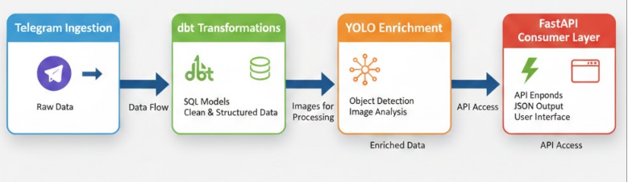
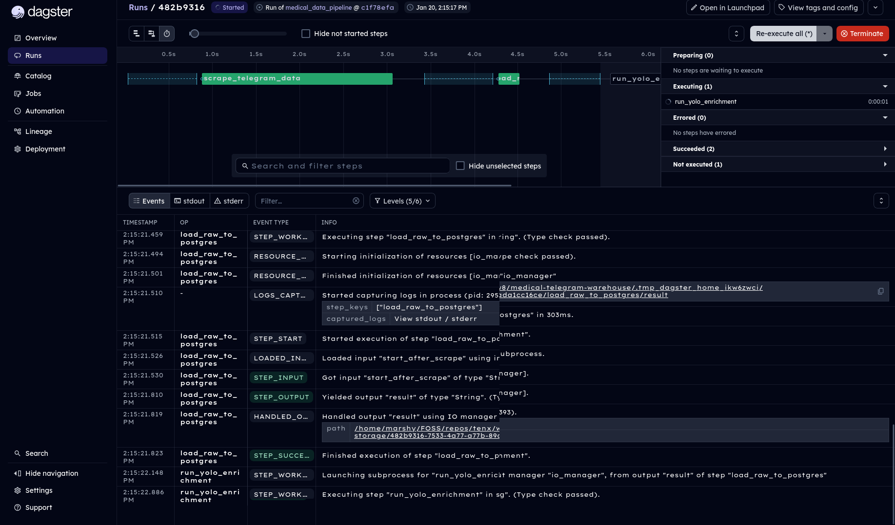
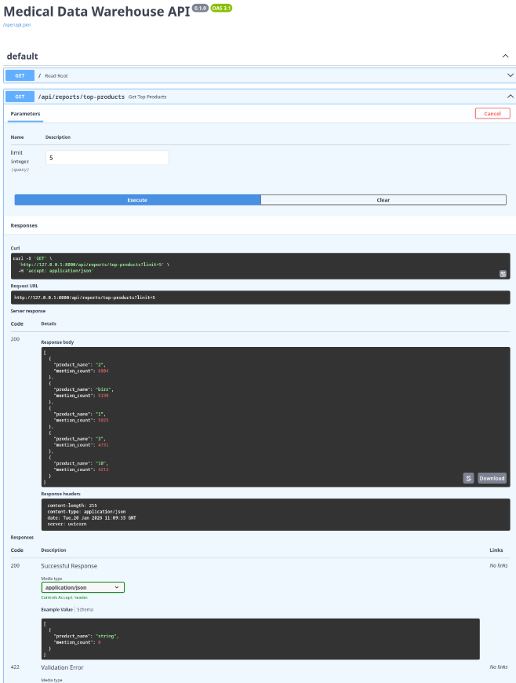

# Ethiopia Medical Data Warehouse 

*A comprehensive End-to-End Data Engineering Pipeline for collecting, transforming, and serving medical supplies data from Telegram channels.*



## Overview

This project builds a robust Data Warehouse to centralize scattered advertising data from Ethiopian medical Telegram channels. It implements a complete ETL pipeline from **raw data ingestion** to **AI-powered enrichment** and **API serving**.

**Key Capabilities:**
- **Scraping**: Automated ingestion of unstructured text and images from Telegram.
- **Object Detection (YOLOv8)**: Detects medical objects (bottles, boxes) in images to estimate product type and engagement potential.
- **Transformation (dbt)**: Cleans and models data into a Star Schema for high-performance analytics.
- **Orchestration (Dagster)**: Manages dependencies and schedules for reliable daily updates.
- **API (FastAPI)**: Serves real-time analytics to downstream applications.

## Key Features

### 1. Orchestrated Pipelines with Dagster
We use Dagster to manage the complexity of dependencies between scraping, loading, and transformations.



### 2. AI-Powered Enrichment
Integrated YOLOv8 model scans every image to categorize content, providing insights into marketing effectiveness (e.g., "Lifestyle" photos vs. "Product" photos).

### 3. API & Analytics
A FastAPI backend serves aggregated insights, such as top-trending products and price distributions.



---

## Reproduction / How to Run

### Prerequisites
- Python 3.10+
- Docker & Docker Compose
- Telegram API Credentials

### 1. Environment Setup

Clone the repo and setup the environment variables:
```bash
git clone https://github.com/affablemelon/medical-telegram-warehouse.git
cd medical-telegram-warehouse
cp .env.example .env
# Edit .env with your TG_API_ID, DB credentials, etc.
```

Install dependencies:
```bash
pip install -r requirements.txt
```

Start the Database (Postgres):
```bash
docker-compose up -d db
```

### 2. Run the Pipeline

You can run individual components or the full orchestration.

**Option A: Manual Execution (Step-by-Step)**

1.  **Scrape Data**:
    ```bash
    python scripts/telegram.py
    ```
2.  **Load to Database**:
    ```bash
    python scripts/loader.py
    ```
3.  **Run Transformations (dbt)**:
    ```bash
    cd medical_warehouse
    dbt deps
    dbt build
    cd ..
    ```

**Option B: Orchestrated (Dagster)**

Start the Dagster UI to trigger runs visually:
```bash
dagster dev
```
Access UI at: `http://localhost:3000`

### 3. Serve the API

Launch the API server to access the data programmatically:
```bash
uvicorn api.main:app --reload
```
Explore the interactive documentation at: [http://127.0.0.1:8000/docs](http://127.0.0.1:8000/docs)

## Project Structure

```bash
medical-telegram-warehouse/
├── api/                 # FastAPI application
├── data/                # Local Data Lake (Raw JSONs & Images)
├── medical_warehouse/   # dbt Project (Transformation Layer)
├── notebooks/           # Jupyter Analysis Notebooks
├── orchestration/       # Dagster Jobs & Schedules
├── reports/             # Generated Diagrams & Project Reports
├── scripts/             # Core scripts (Scraper, Loader, YOLO)
└── src/                 # Shared Utilities
```
